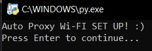
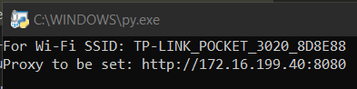
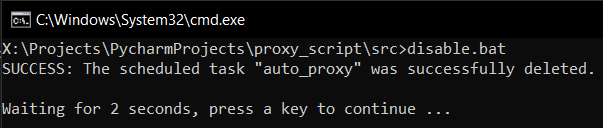

# auto_proxy_wifi

Python Automation Script for Windows devices to automatically configure a proxy server on a wifi network based on the network's SSID. Works using Windows environment variables, registry and CLI tools (Netsh).

Utilizes Windows `schtasks` CLI tool for automatic event scheduling on Wi-Fi network change.

## Set-Up and Usage

- To set Proxy rules (which Proxy should be used for which Wi-Fi SSID) just modify the respective `main.py` or `main_loop.py` file and add the rule to `proxy_rules` as shown in the example rule. Wi-Fi names in Proxy Rules are case-insensitive.

  Syntax for each ProxyRule: `ProxyRule(wifi_ssid: string, proxy_address: string, proxy_type: string (optional))`.

   ```python
      proxy_rules: list = [
          ProxyRule("wifi1", "http://proxy1:port1", "https"), # If Wi-Fi connected is wifi1, proxy should be http://proxy1:port1
          ProxyRule("wifi2", "proxy2:port2", "socks5"),
          ProxyRule("wifi3", ""), # If Wi-Fi connected is wifi3, there will be no proxy.
      ]
   ```

- There are two potential ways to use this script:

  1. **Using Python Script `./src/main_loop.py` (More Memory-Intensive)**

     - Just execute `./src/main_loop.py` with Python and watch the magic happen every time you switch Wi-Fi networks. :)

  2. **Using Windows Scheduled Task Triggering with `./src/main.py` (Less Memory-Intensive)**

     - Open any terminal and CD into src folder `cd <path_to_repo>/src`.
     - Run `python3 ./setup.py` once and everything will be set up. :)

|  |
| --- |

|  |
| --- |

## Removal

- To Disable the script, just run `./src/disable.bat` and the scheduled event will be disabled.
- To Uninstall, remove this auto_proxy_wifi folder with all its contents.

|  |
| --- |
